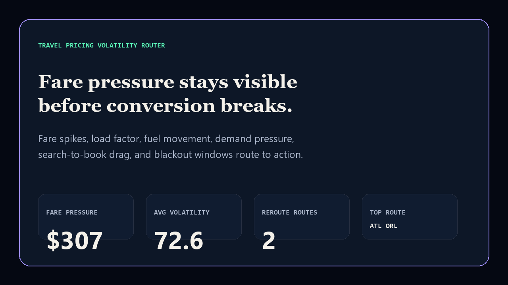
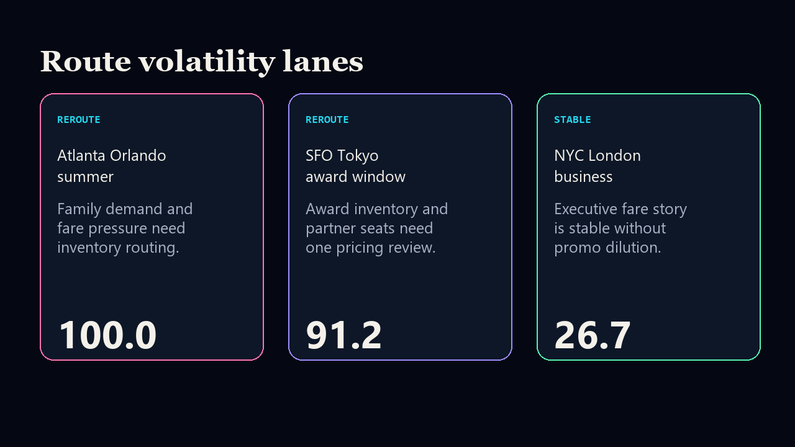

# travel-pricing-volatility-router

[](https://github.com/mizcausevic-dev/travel-pricing-volatility-router/actions/workflows/ci.yml)
[](https://github.com/mizcausevic-dev/travel-pricing-volatility-router/actions/workflows/pages.yml)
[](LICENSE)

Travel pricing volatility router for fare spikes, load factor, fuel movement, demand pressure, search-to-book drag, blackout windows, and route-level remediation.

## Why this exists

- Travel and hospitality pricing breaks when fare pressure, loyalty inventory, demand spikes, and blackout windows are reviewed separately.
- Leaders need one route-level view before conversion, customer trust, or revenue capture breaks.
- Recruiters and buyers looking for `Java / Python / SQL / travel pricing / revenue management` proof should see a real operator surface.

## What it shows

- TypeScript scoring engine and static proof surface.
- Java implementation for enterprise pricing-rule environments.
- Python analytics mirror for route review.
- SQL source contract for reviewed pricing evidence fields.

## Screenshots





## Local run

```bash
npm install
npm run verify
npm run prerender
```

## CLI

```bash
npx tsx src/cli.ts fixtures/travel-pricing.json
npx tsx src/cli.ts fixtures/travel-pricing.json --format=json
```

## Kinetic Gain fit

This repo expands the travel and hospitality lane: volatile pricing, demand spikes, and route remediation become a board-readable operating surface instead of disconnected analytics notes.
